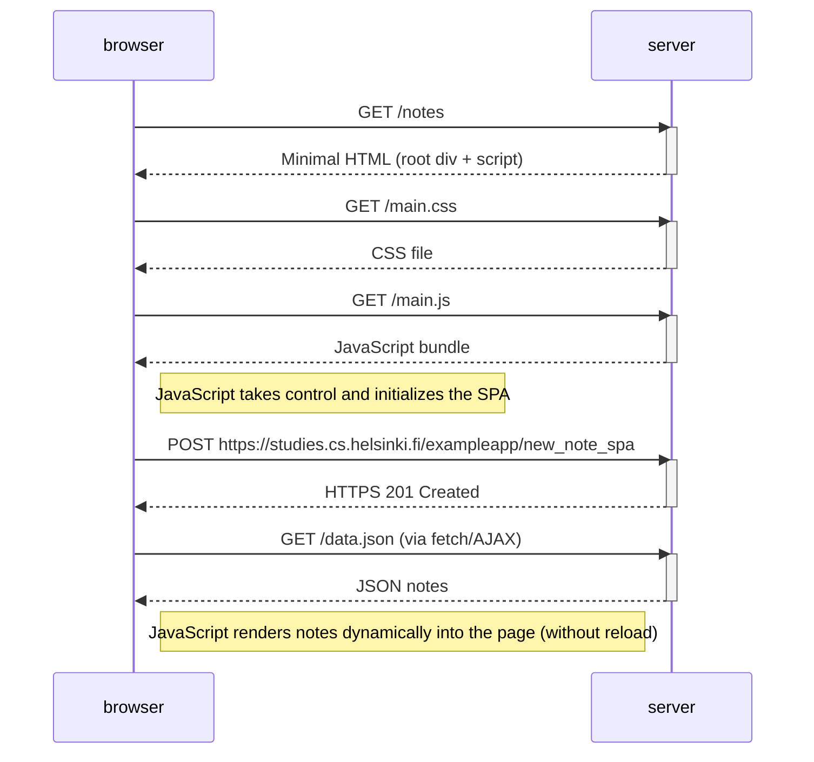

```mermaid

sequenceDiagram
    participant browser
    participant server

    browser->>server: GET /notes
    activate server
    server-->>browser: Minimal HTML (root div + script)
    deactivate server

    browser->>server: GET /main.css
    activate server
    server-->>browser: CSS file
    deactivate server

    browser->>server: GET /main.js
    activate server
    server-->>browser: JavaScript bundle
    deactivate server

    Note right of browser: JavaScript takes control and initializes the SPA

    browser->>server: POST https://studies.cs.helsinki.fi/exampleapp/new_note_spa
    activate server
    server-->>browser: HTTPS 201 Created
    deactivate server

    browser->>server: GET /data.json (via fetch/AJAX)
    activate server
    server-->>browser: JSON notes
    deactivate server

    Note right of browser: JavaScript renders notes dynamically into the page (without reload)
```